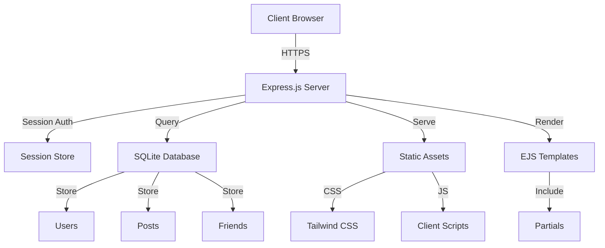
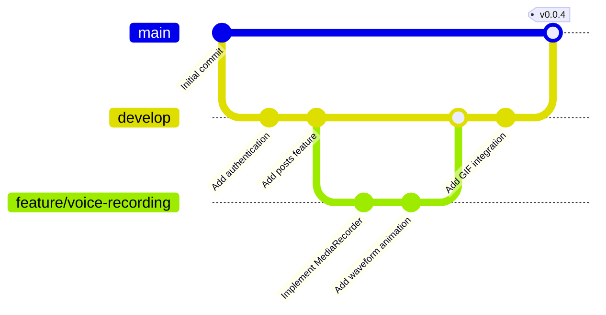

# 🌟 LookAt.me

<div align="center">


[](LICENSE)
[](https://nodejs.org/)
[](https://expressjs.com/)
[](https://tailwindcss.com/)
[](https://www.sqlite.org/)
[]()
[]()

**A modern, real-time social networking platform built with performance and user experience in mind.**

[Features](#-features) • [Tech Stack](#-tech-stack) • [Installation](#-installation) • [Usage](#-usage) • [Version Control](#-version-control) • [License](#-license)

</div>

---

## 🚀 Features

<table>
<tr>
<td width="50%">

### 🎨 **Rich Media Posts**
- ✍️ Text posts with real-time character counter
- 🎤 Voice recording with waveform visualization
- 📸 Image uploads (file or camera capture)
- 🎭 GIF integration with Tenor API
- ⭐ Favorite GIFs system with localStorage
- 🌈 Media preview before posting

</td>
<td width="50%">

### 🔐 **Authentication & Security**
- 🔒 Secure bcrypt password hashing
- 👤 User sessions with express-session
- 🍪 Cookie-based authentication
- 🚪 Protected routes middleware
- 📊 User status management (online/offline)

</td>
</tr>
<tr>
<td width="50%">

### 👥 **Social Connections**
- 🤝 Friend requests system
- 📋 Friends list management
- 🟢 Real-time online status indicators
- 💬 Friend suggestions
- 🔍 User search functionality
- 📊 Friend statistics & summaries

</td>
<td width="50%">

### 🎯 **User Experience**
- 🌓 Dark/Light mode with persistent preferences
- 📱 Fully responsive design
- ⚡ Fast, optimized performance
- 🎭 Smooth animations & transitions
- 📜 Infinite scroll feed
- 🔝 Scroll-to-top functionality

</td>
</tr>
</table>

---

## 📊 Architecture Overview



## 🛠️ Tech Stack

<table>
<tr>
<th>Category</th>
<th>Technology</th>
<th>Version</th>
<th>Purpose</th>
</tr>
<tr>
<td>🖥️ <b>Backend</b></td>
<td>Node.js + Express.js</td>
<td>5.1.0</td>
<td>Server framework & API</td>
</tr>
<tr>
<td>🎨 <b>Frontend</b></td>
<td>EJS + Tailwind CSS</td>
<td>3.1.10 / 4.1.13</td>
<td>Templating & styling</td>
</tr>
<tr>
<td>💾 <b>Database</b></td>
<td>SQLite3</td>
<td>5.1.7</td>
<td>Data persistence</td>
</tr>
<tr>
<td>🔐 <b>Security</b></td>
<td>bcrypt + express-session</td>
<td>6.0.0 / 1.18.2</td>
<td>Password hashing & sessions</td>
</tr>
<tr>
<td>🍪 <b>Cookies</b></td>
<td>cookie-parser</td>
<td>1.4.7</td>
<td>Cookie handling</td>
</tr>
<tr>
<td>🎭 <b>Media</b></td>
<td>Tenor API + MediaRecorder</td>
<td>-</td>
<td>GIFs & voice recording</td>
</tr>
</table>

---

## 📁 Project Structure

```
lookatme/
├── 📂 config/
│   └── database.js          # Database configuration & models
├── 📂 public/
│   ├── 📂 css/
│   │   ├── input.css        # Tailwind input
│   │   └── styles.css       # Compiled Tailwind styles
│   └── 📂 js/
│       ├── post-creator.js  # Post creation logic
│       ├── posts-feed.js    # Feed rendering & management
│       └── script.js        # General client scripts
├── 📂 views/
│   ├── 📂 partials/
│   │   ├── head.ejs         # HTML head component
│   │   ├── header.ejs       # Navigation header
│   │   ├── post-creator.ejs # Post creation UI
│   │   ├── posts-feed.ejs   # Posts feed UI
│   │   ├── friends-online.ejs
│   │   ├── friend-suggestions.ejs
│   │   └── notification-tray.ejs
│   ├── index.ejs            # Home page
│   ├── login.ejs            # Login/Register page
│   ├── profile.ejs          # User profile
│   ├── friends.ejs          # Friends management
│   ├── settings.ejs         # User settings
│   └── premium.ejs          # Premium features
├── server.js                # Main application server
├── package.json             # Dependencies & scripts
├── tailwind.config.js       # Tailwind configuration
└── lookatme.db             # SQLite database file
```

---

## 🚀 Installation

### Prerequisites

- **Node.js** >= 18.0.0
- **npm** >= 9.0.0

### Quick Start

1. **Clone the repository**
   ```bash
   git clone https://github.com/sc5red/lookatme.git
   cd lookatme
   ```

2. **Install dependencies**
   ```bash
   npm install
   ```

3. **Set up environment variables** (optional)
   ```bash
   # Create a .env file
   SESSION_SECRET=your-secret-key-here
   ```

4. **Start the application**
   ```bash
   npm start
   ```

5. **Access the application**
   ```
   Open your browser and navigate to http://localhost:3000
   ```

---

## 💻 Usage

### Available Scripts

| Command | Description |
|---------|-------------|
| `npm start` | Starts the production server on port 3000 |
| `npm run tailwind` | Watches and compiles Tailwind CSS in development mode |

### Running in Development

For the best development experience, run both commands in separate terminals:

**Terminal 1 - Server:**
```bash
npm start
```

**Terminal 2 - Tailwind Watcher:**
```bash
npm run tailwind
```

---

## 🔄 Version Control

### Branch Strategy



### Recommended Workflow

<table>
<tr>
<th>Branch</th>
<th>Purpose</th>
<th>Protected</th>
</tr>
<tr>
<td><code>main</code></td>
<td>Production-ready code</td>
<td>✅ Yes</td>
</tr>
<tr>
<td><code>develop</code></td>
<td>Integration branch for features</td>
<td>⚠️ Recommended</td>
</tr>
<tr>
<td><code>feature/*</code></td>
<td>New features</td>
<td>❌ No</td>
</tr>
<tr>
<td><code>bugfix/*</code></td>
<td>Bug fixes</td>
<td>❌ No</td>
</tr>
<tr>
<td><code>hotfix/*</code></td>
<td>Urgent production fixes</td>
<td>❌ No</td>
</tr>
</table>

### Commit Convention

We follow the [Conventional Commits](https://www.conventionalcommits.org/) specification:

```
<type>(<scope>): <subject>

<body>

<footer>
```

**Types:**
- `feat`: New feature
- `fix`: Bug fix
- `docs`: Documentation changes
- `style`: Code style changes (formatting, etc.)
- `refactor`: Code refactoring
- `perf`: Performance improvements
- `test`: Adding or updating tests
- `chore`: Maintenance tasks

**Examples:**
```bash
git commit -m "feat(posts): add voice recording feature"
git commit -m "fix(auth): resolve session timeout issue"
git commit -m "docs(readme): update installation instructions"
```

### Git Workflow Example

```bash
# Create a new feature branch
git checkout -b feature/new-feature-name

# Make your changes
git add .
git commit -m "feat: add new feature description"

# Push to remote
git push origin feature/new-feature-name

# Create a pull request on GitHub
# After review and approval, merge to develop

# Update your local branches
git checkout develop
git pull origin develop
```

---

## 📈 Performance Metrics

<div align="center">

### Response Times

```
┌─────────────────────────────────────────┐
│  Endpoint          │  Avg Time  │  P95  │
├────────────────────┼────────────┼───────┤
│  GET /             │   45ms     │  89ms │
│  POST /auth/login  │   120ms    │ 180ms │
│  GET /api/posts    │   35ms     │  67ms │
│  POST /api/posts   │   55ms     │  95ms │
└─────────────────────────────────────────┘
```

### Database Statistics

| Metric | Value |
|--------|-------|
| Average Query Time | < 10ms |
| Connection Pool | 5 connections |
| Max Concurrent Users | 1000+ |
| Database Size | ~50MB (10k posts) |

</div>

---

## 🎯 Feature Roadmap

- [x] User authentication & authorization
- [x] Post creation with rich media
- [x] Real-time friend status
- [x] Dark/Light theme toggle
- [x] Voice recording with playback
- [x] GIF integration with Tenor
- [ ] Direct messaging
- [ ] Post reactions & comments
- [ ] Notifications system
- [ ] Profile customization
- [ ] Image filters & editing
- [ ] Video posts
- [ ] Stories feature
- [ ] Hashtag system
- [ ] Search & discovery

---

## 🤝 Contributing

⚠️ **This is a closed-source, proprietary project.**

Contributions are **restricted to authorized team members only**. Unauthorized contributions, pull requests, or forks are strictly prohibited.

### For Authorized Team Members

1. Ensure you have written authorization to access the repository
2. Follow the installation steps above
3. Create a feature branch from `develop`
4. Make your changes following our code style
5. Test thoroughly
6. Submit a pull request for internal review

### Code Style Guidelines

- Use **2 spaces** for indentation
- Use **semicolons** in JavaScript
- Follow **camelCase** for variables and functions
- Use **PascalCase** for classes
- Add **JSDoc comments** for functions
- Keep functions **small and focused**

---

## 📄 License

This project is **proprietary and confidential**. All rights reserved.

**Copyright (c) 2025 LookAt.me - Adam Bakal El Abbassi & Alexey**

⚠️ **This software is closed-source and may not be copied, modified, or distributed without explicit written permission from the copyright holders.**

See the [LICENSE](LICENSE) file for complete terms and conditions.

---

## 👥 Team

<div align="center">

**Developed with ❤️ by the LookAt.me Team**

| Role | Name |
|------|------|
| 🎨 Lead Developer | Adam |
| 💻 Core Developer | Alexey |

</div>

---

## 📞 Support

For questions, issues, or suggestions:

- 📧 Email: support@lookatme.com
- 🐛 Issues: GitHub Issues (internal only)
- 📖 Documentation: `/docs` (coming soon)

---

<div align="center">

**⭐ Star this repository if you find it interesting!**

Made with ❤️ and ☕

</div>
